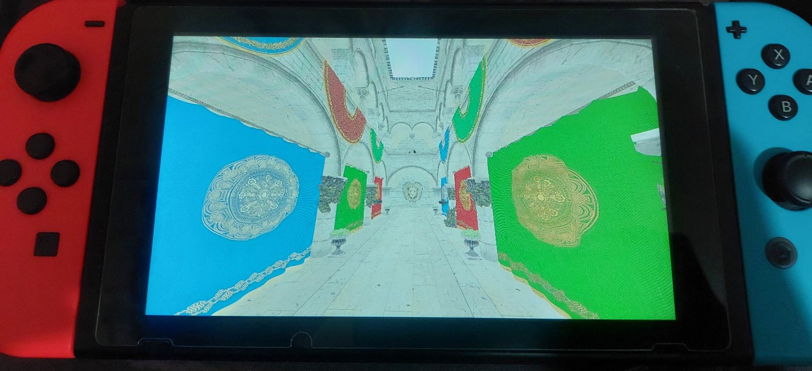

# Switch : a homebrew Nintendo Switch sandbox for graphics and game engine programming.


(Screenshot by Kripesh Adhikari)

Switch is a 3D renderer and lightweight graphics sample written in C, running exclusively on Nintendo Switch. It is using devkitPro's libNX SDK and the Deko3D API.

## Building

Make sure you have devkitPro installed.
Afterwards,
```bat
build.bat
```
And that's it! Launch the .nro file using your emulator of choice or by dumping it on your console.

## Status

- Tested on:
    - Ryujinx (r.b4cac89)
    - Suyu (dev-0de49070e4)
    - Yuzu (master-67bc8a6de)
    - Switch (18.1.0, Atmosphere 1.7.1)

## Roadmap

- Rework GPU allocator
- GPU mipmaps

## Authors

- Amélie Heinrich
- Kripesh Adhikari
